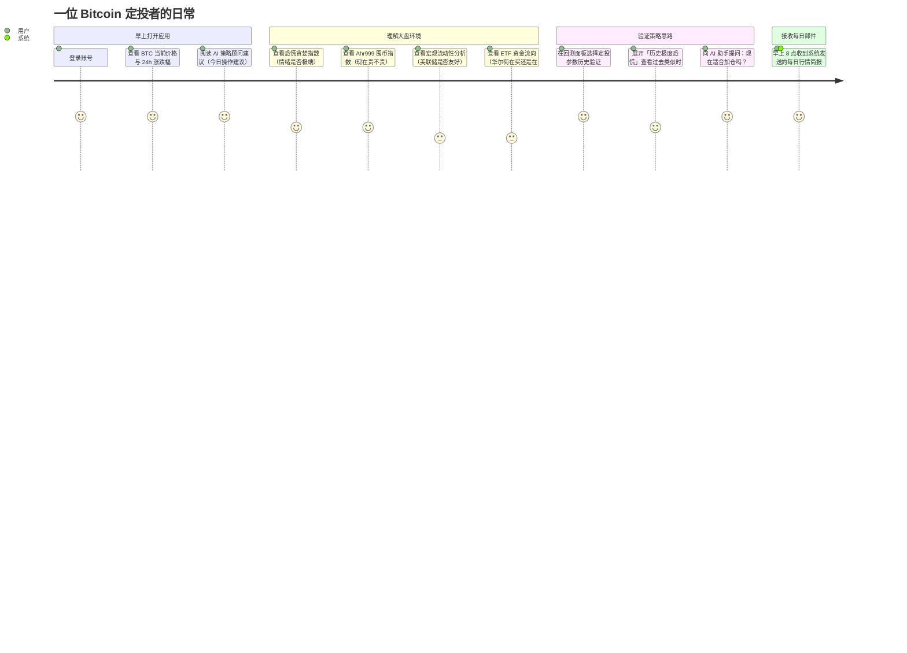
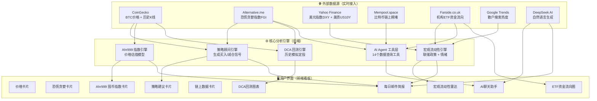
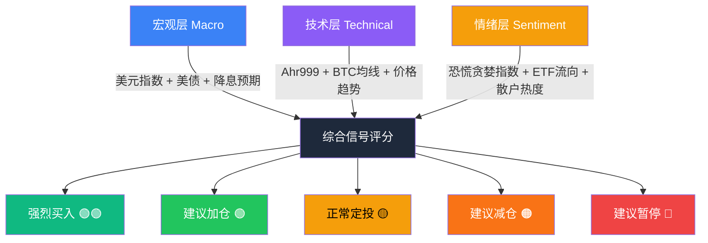
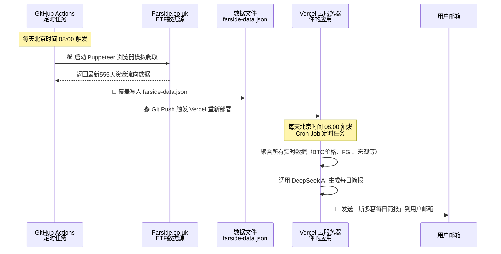

# 📦 整体系统架构与用户旅程

> **写在前面**：这份文档面向非技术读者，带你一眼看清这个应用的「全貌」——数据从哪来、经过了什么处理、最终以什么形式呈现给你。

---

## 1. 这款产品是什么？

**DCA Strategy Agent** 是一款面向比特币长期定投者（HODLer）的智能决策助手。

它的核心价值是：
- 把复杂的全球宏观数据、链上指标和情绪指数，**自动汇总并翻译成你看得懂的操作建议**；
- 提供可回测的历史数据验证，让你相信「这套逻辑是有数据支撑的」；
- 内置一个 AI 助手，让你可以直接用自然语言提问，不再需要每天手动查数。

---

## 2. 用户旅程（你的一天）

---

## 3. 全系统数据流向

---

## 4. 系统核心信号层级

应用将复杂世界简化为三个维度的信号，综合后形成最终建议：

---

## 5. 自动化与定时任务

系统不需要你每天手动触发。它具备以下自动化机制：

---

## 6. 各核心模块说明概要

| 模块名 | 功能 | 数据来源 | 参见文档 |
|--------|------|----------|----------|
| 策略顾问引擎 | 生成买入/减仓信号 | FGI + BTC价格 | `02-strategy-signal-engine.md` |
| Ahr999 囤币指数 | 判断当前价格贵不贵 | BTC历史价格 | `03-ahr999-engine.md` |
| DCA 回测引擎 | 历史定投模拟验证 | BTC历史K线 + FGI | `04-dca-backtest-engine.md` |
| 宏观流动性分析 | 美联储政策影响评估 | Yahoo Finance + Google Trends | `05-macro-liquidity-engine.md` |
| AI 智能助手 | 自然语言查询所有数据 | 以上所有工具 | `06-ai-agent-toolkit.md` |
