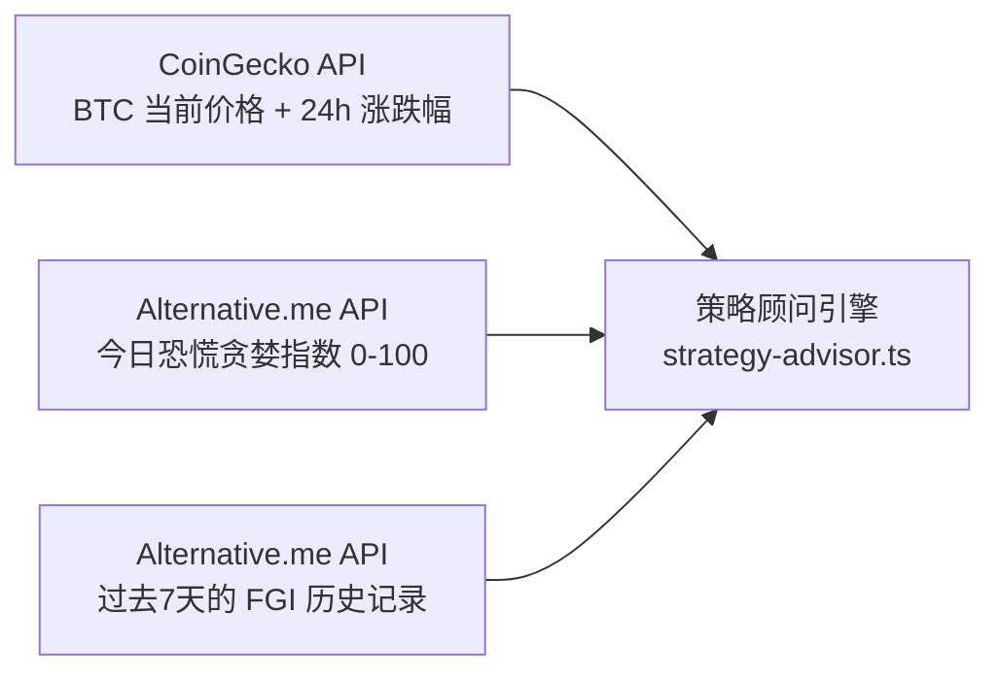
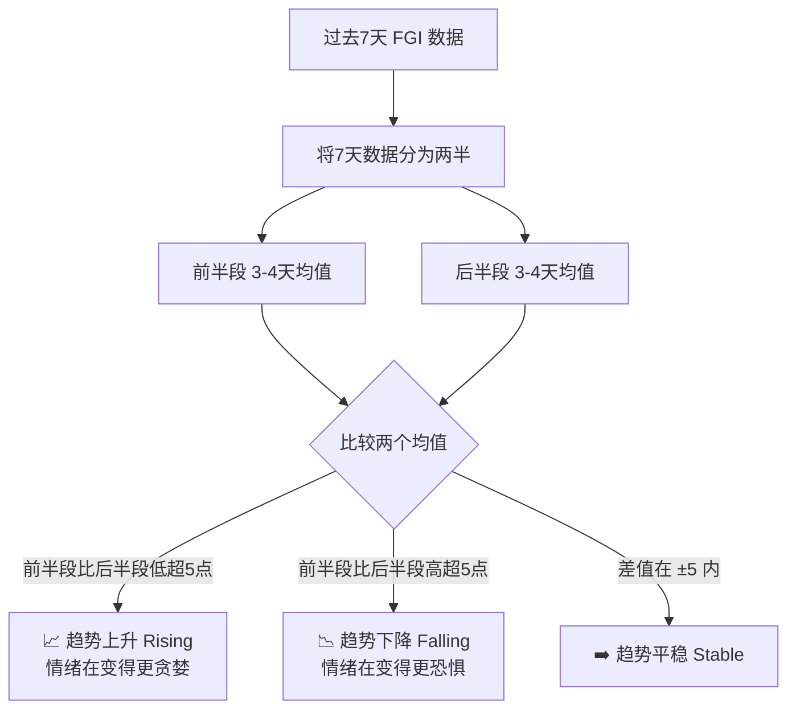
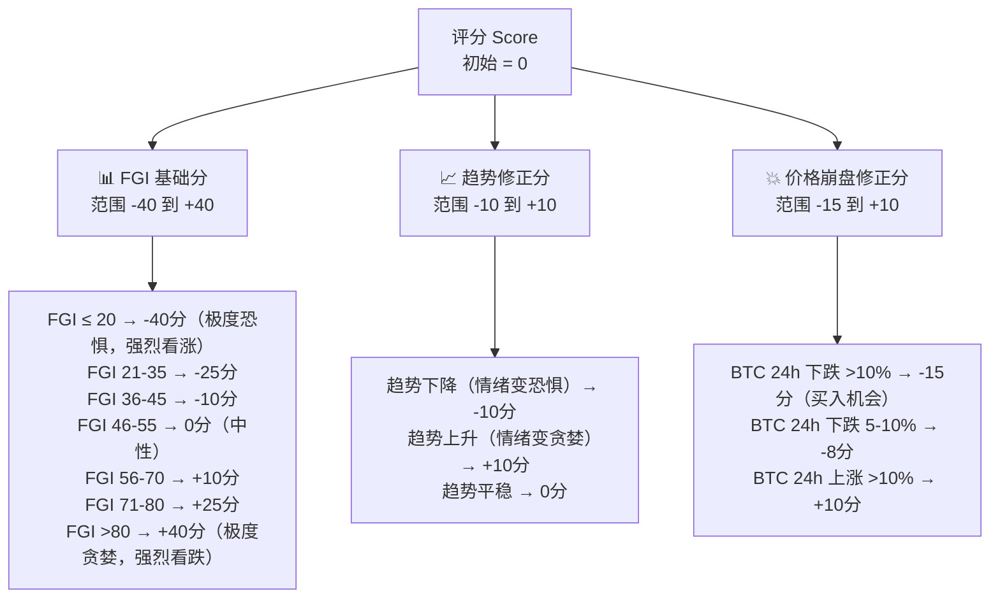
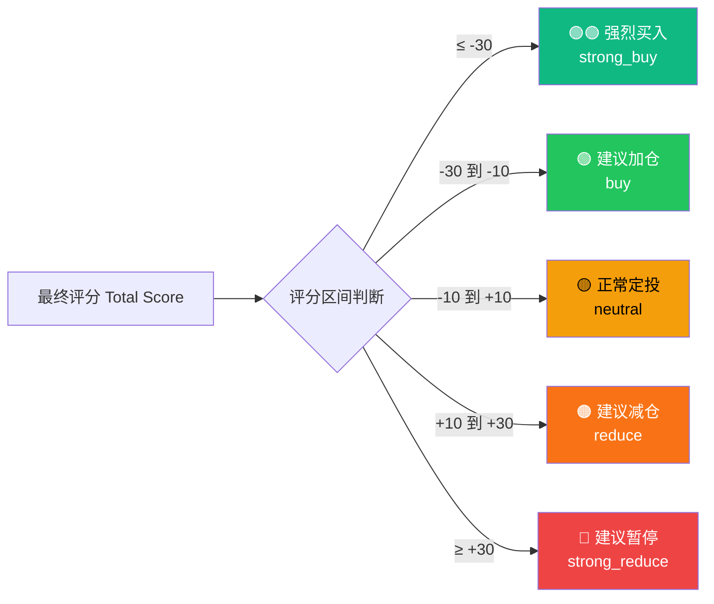
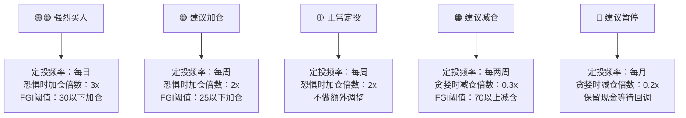
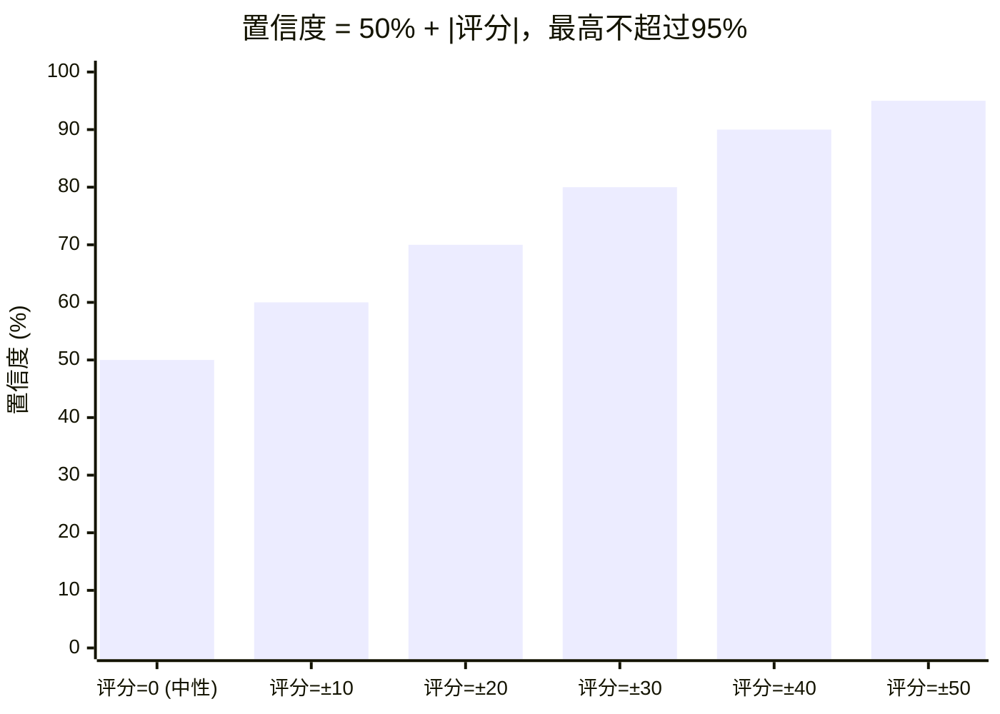
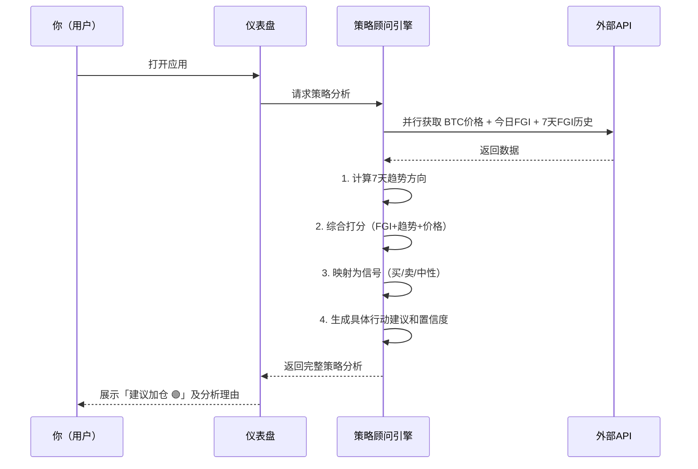

# 🎯 策略顾问引擎：如何生成买入信号

> **读完本文你将理解**：当你打开应用看到"建议加仓 🟢"或"建议暂停 🔴"时，系统是怎么算出来的。

---

## 1. 核心问题：今天应该买比特币吗？

这个看似简单的问题，需要同时参考三个维度：
1. **当前市场情绪有多极端？**（靠恐慌贪婪指数 FGI）
2. **情绪正在往哪个方向走？**（7天趋势是上升还是下降）
3. **价格本身最近波动有多剧烈？**（24小时涨跌幅）

---

## 2. 数据输入阶段

**关键概念：恐慌贪婪指数（FGI）**

> 0 = 极度恐慌（大家都在抛售，通常是好的买入机会）
> 100 = 极度贪婪（大家都在追涨，通常是风险区间）
>
> 贪婪时人群涌入，是你该离场的时候。恐惧时人群出逃，是你该入场的时候。——沃伦·巴菲特

---

## 3. 计算步骤一：判断情绪趋势（7天方向）

系统不只看今天的FGI，还分析**过去7天的走势方向**：

---

## 4. 计算步骤二：打分系统

系统使用一个**评分系统**，把多个信号合并成一个数字：

**注意**：`负分`代表看涨信号（价格便宜/恐惧时买），`正分`代表看跌信号（价格贵/贪婪时减）。

---

## 5. 计算步骤三：将评分映射为操作信号

---

## 6. 各信号对应的具体行动建议

当系统生成信号后，还会自动推荐具体的定投参数：

---

## 7. 置信度（Confidence）是什么意思？

信号还会附带一个"置信度"（0-95%），代表系统对这个判断有多确定：

> **通俗理解**：评分越极端（比如FGI=8，大崩盘），置信度就越高，系统更确信该买。评分在中间（FGI=50左右，市场平静），置信度在50%左右，信号较弱。

---

## 8. 完整系统流程总结

