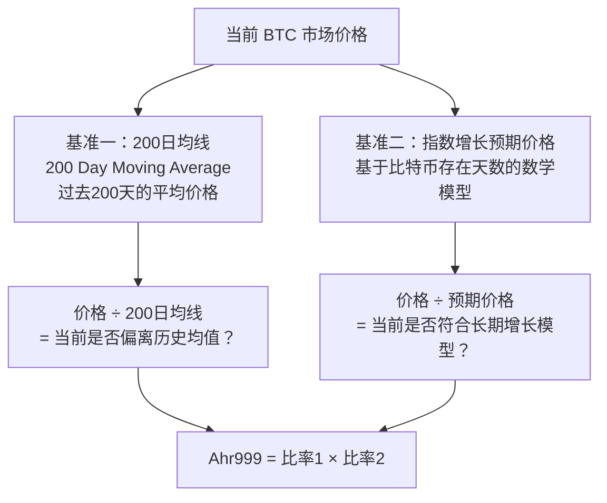
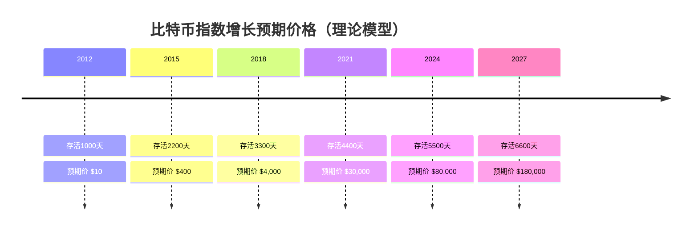
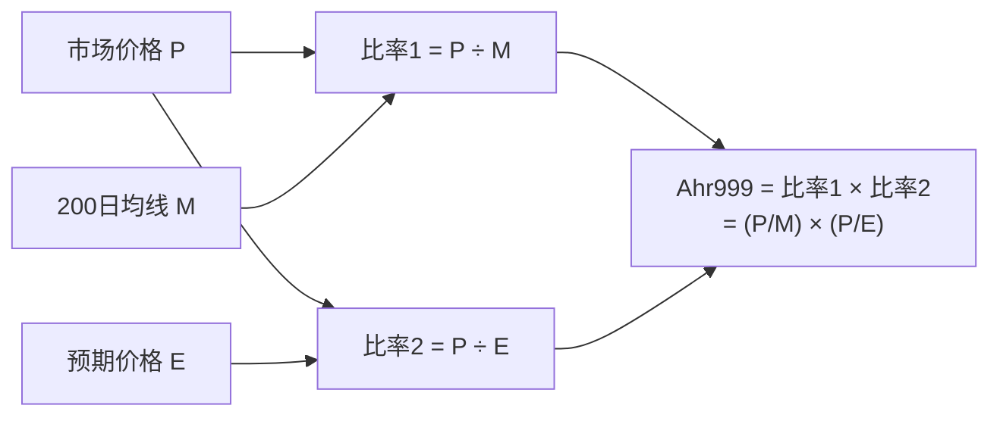
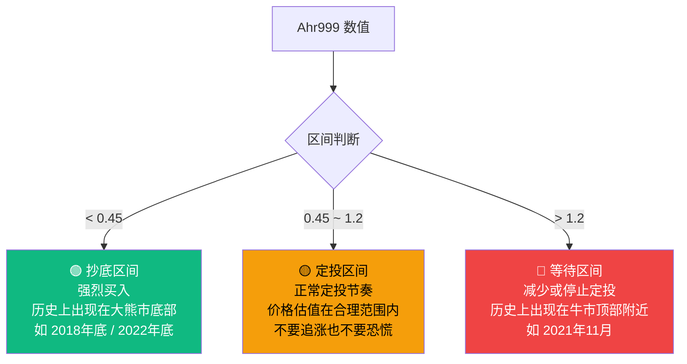
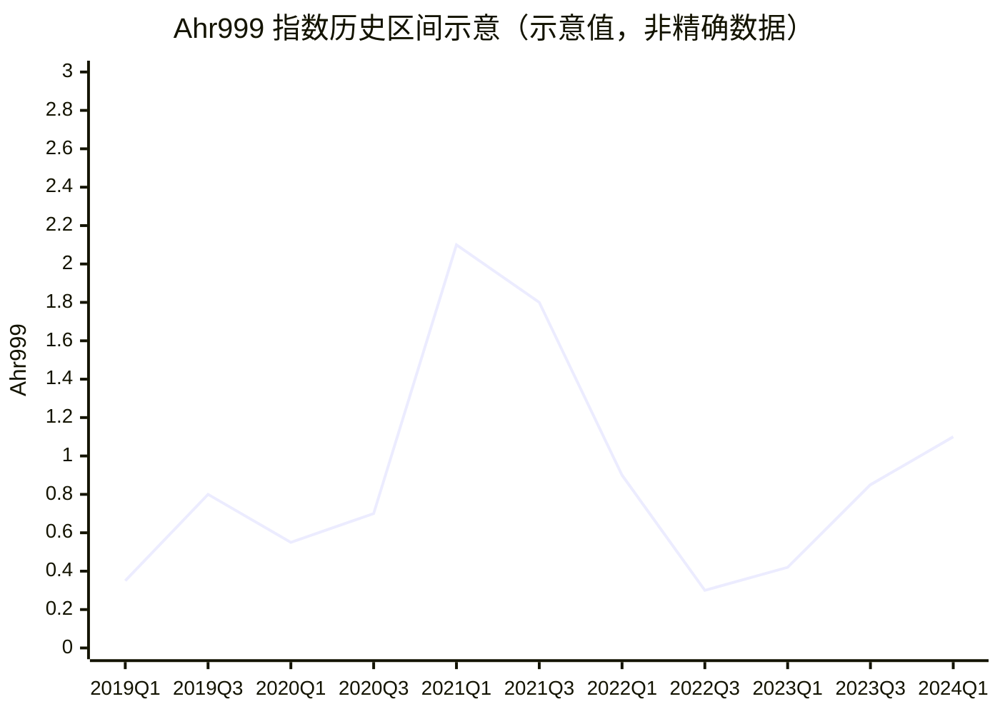
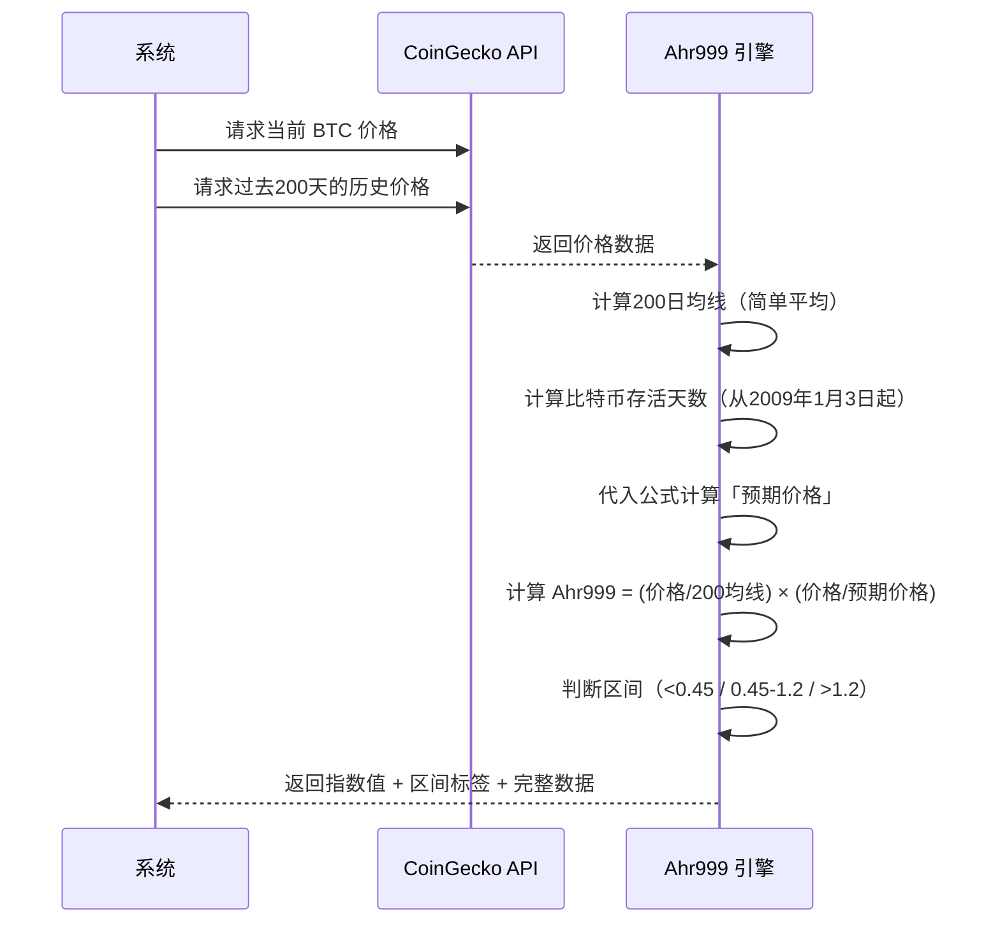
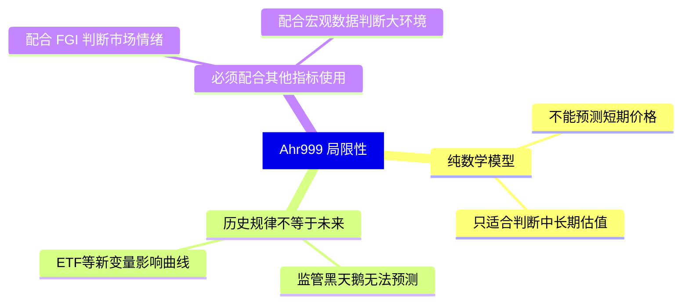

# 📐 Ahr999 囤币指数：当前价格贵不贵？

> **读完本文你将理解**：当你看到"Ahr999 = 0.82 (🟡 定投区间)"时，这个数字是怎么算出来的，以及它究竟意味着什么。

---

## 1. 一个核心问题：比特币现在贵吗？

价格 $80,000 是贵还是便宜？
- 如果 2021 年你说贵，你是对的（随后暴跌）
- 如果 2023 年你说贵，你是错的（随后翻倍）

Ahr999 解决了这个问题：它不是看**绝对价格**，而是看**相对于两个基准的位置**。

---

## 2. 两个基准是什么？



---

## 3. 「指数增长预期价格」是什么

这是 Ahr999 指标最独特的部分。它基于一个观察：

> **比特币诞生至今越来越多天，其「公平价值」理论上也随着时间指数增长。**

计算公式：
```
预期价格 = 10 ^ (5.84 × log₁₀(比特币存活天数) - 17.01)
```

用人话解释：



> **注意**：这只是数学模型，不是预测！但它提供了一个「如果比特币保持历史增长曲线，价格应该在哪」的参考。

---

## 4. Ahr999 计算公式



**数学含义**：
- `比率1 < 1`：价格低于200日均线（相对历史偏低）
- `比率2 < 1`：价格低于模型预期（便宜）
- 两个都小于1 → Ahr999 会很小 → 绝佳买入机会

---

## 5. 三个区间对应不同操作



---

## 6. 历史案例参考



> 2021年初超过2.0（极度高估），随后进入熊市。2022年底跌到0.3（极度低估），随后反转。

---

## 7. 完整计算流程



---

## 8. 本指标的局限性



> **使用建议**：把 Ahr999 作为定投「力度」的参考，不要作为唯一决策依据。比如 Ahr999 < 0.5 时可以双倍加仓；> 1.5 时可以减半定投，而不是停止。
