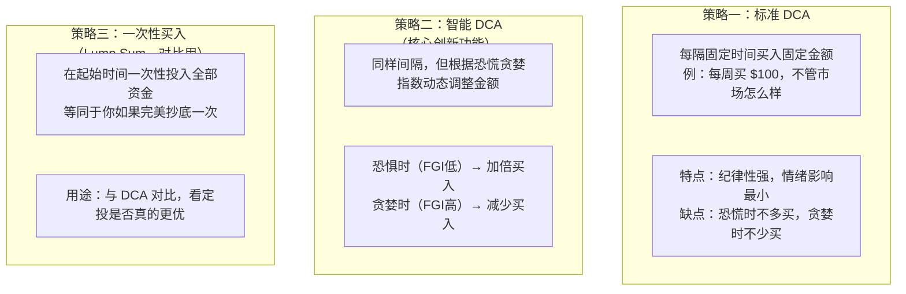
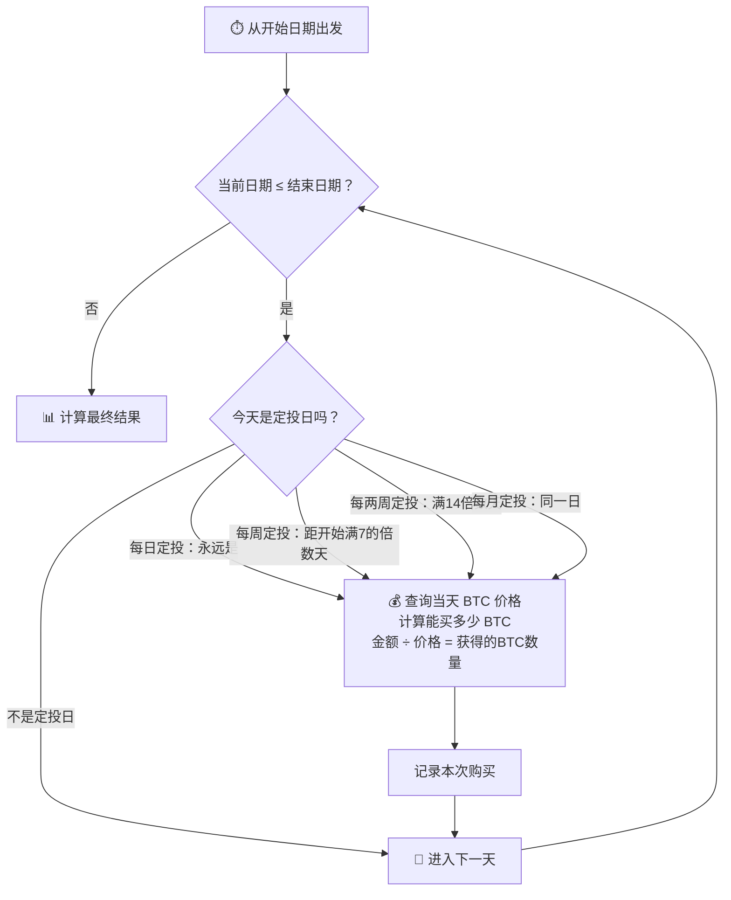
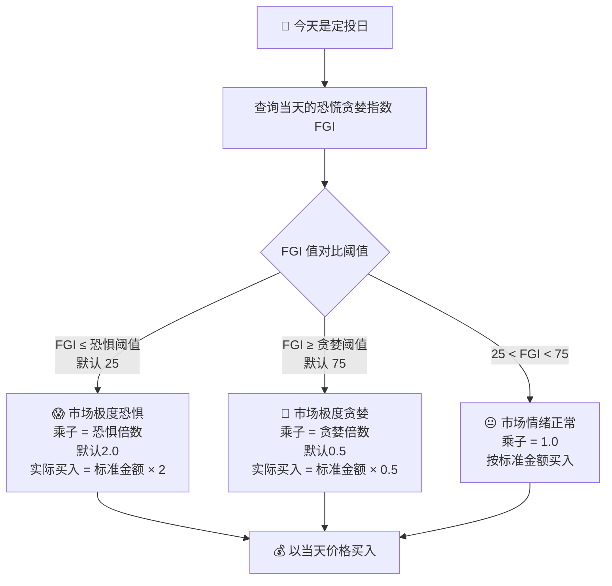
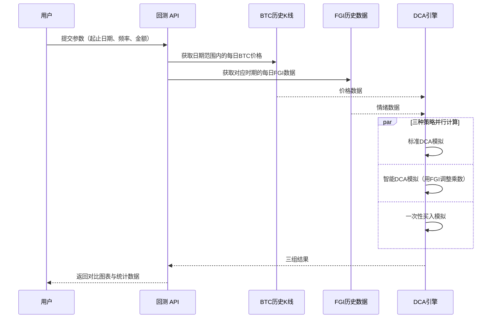
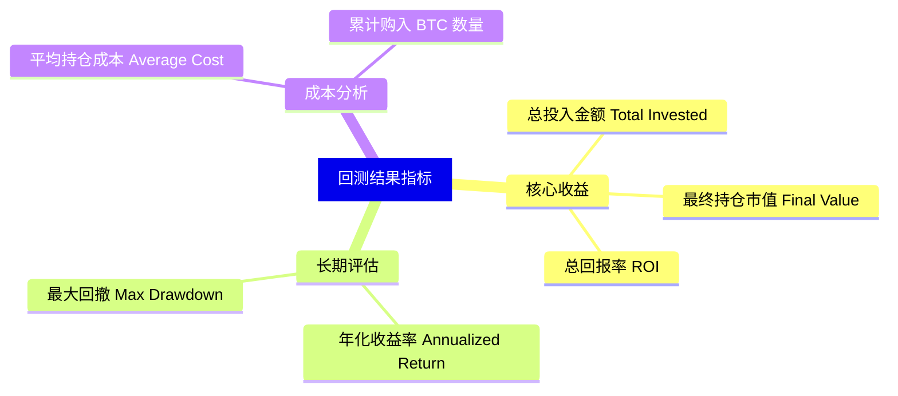
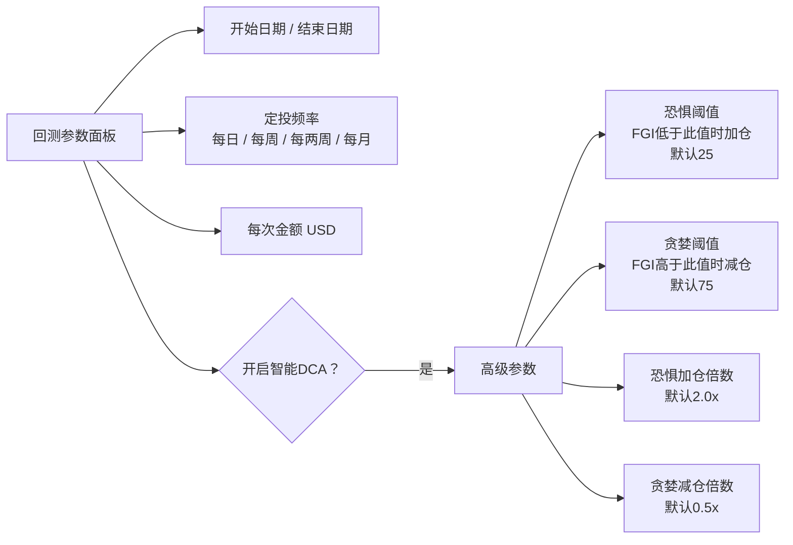
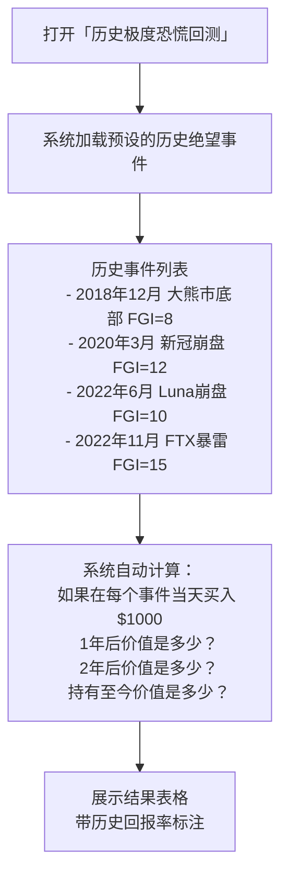

# 🔄 DCA 回测引擎：历史数据模拟定投

> **读完本文你将理解**：「回测」功能是什么，系统如何比较三种不同的定投策略，以及「智能 DCA」比普通定投强在哪里。

---

## 1. 什么是「回测」？

回测（Backtest）就是：**拿历史数据，模拟你如果在过去按照某种策略买入，现在会赚多少钱**。

它解决一个核心问题：
> "我的定投策略在历史上真的有效吗？还是我只是在运气好的时候才盈利？"

---

## 2. 三种策略的区别

系统支持同时比较三种策略，让你一眼看出哪种最优：

---

## 3. 标准 DCA 的运行逻辑

---

## 4. 智能 DCA 的核心差异：动态乘数

这是产品最核心的差异化功能。普通定投买固定额，智能DCA会「情绪感知」：

**举例**：你设置每周买 $100，恐惧阈值25，贪婪阈值75，恐惧倍数2x：
- 某周 FGI=15（极度恐惧）→ 实际买入 **$200**（抄底加仓）
- 某周 FGI=50（正常）→ 实际买入 **$100**（标准）
- 某周 FGI=85（极度贪婪）→ 实际买入 **$50**（减少）

---

## 5. 三种策略的完整比较流程

---

## 6. 结果指标详解

回测完成后，系统会计算以下指标：

**最大回撤**（Max Drawdown）解释：
> 从你持仓市值的历史最高点，到随后某个最低点，跌了多少百分比。
> 比如持仓最高值 $10,000，后来跌到 $6,000，最大回撤 = 40%。
> 这个数越小，说明策略越稳定，波动越小。

---

## 7. 可调参数说明

---

## 8. 历史恐慌时刻回测（Stoic Pattern）

这是一个特别功能：查看**历史上极度恐慌时买入，回报有多高**。

> **使用方法**：点击"DCA回测参数"卡片最下方的「历史极度恐慌回测」按钮，展开查看。它是一个精神锚点——当你下次看到市场极度恐慌时，回看这个表格，你会更有勇气执行定投纪律。
