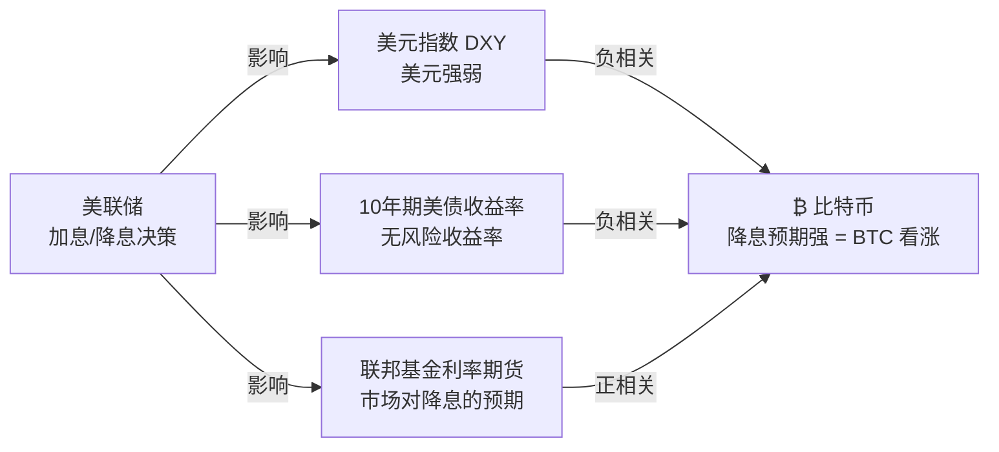
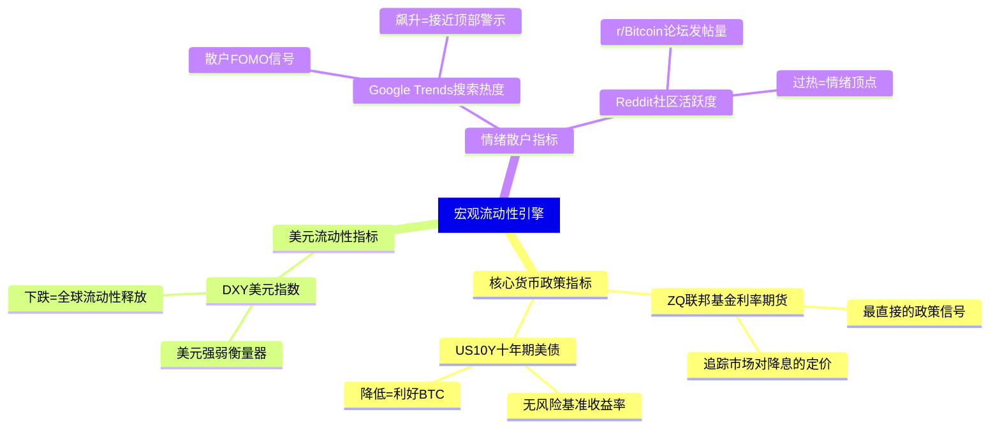
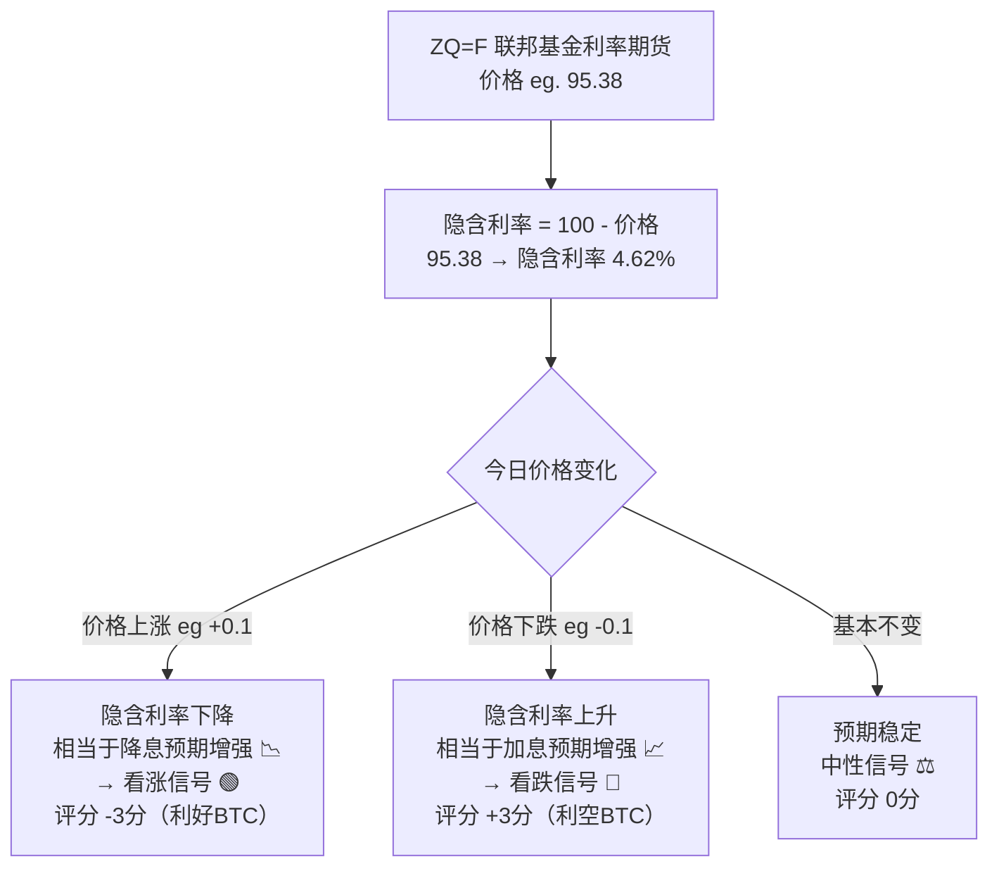
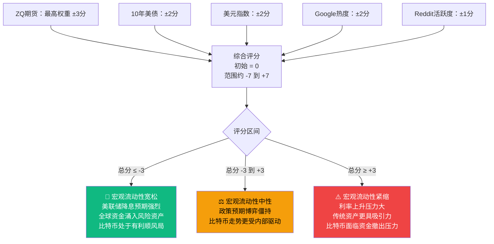
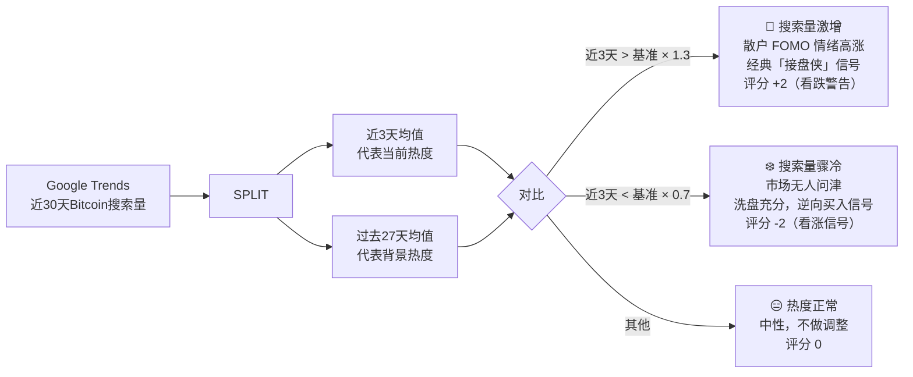
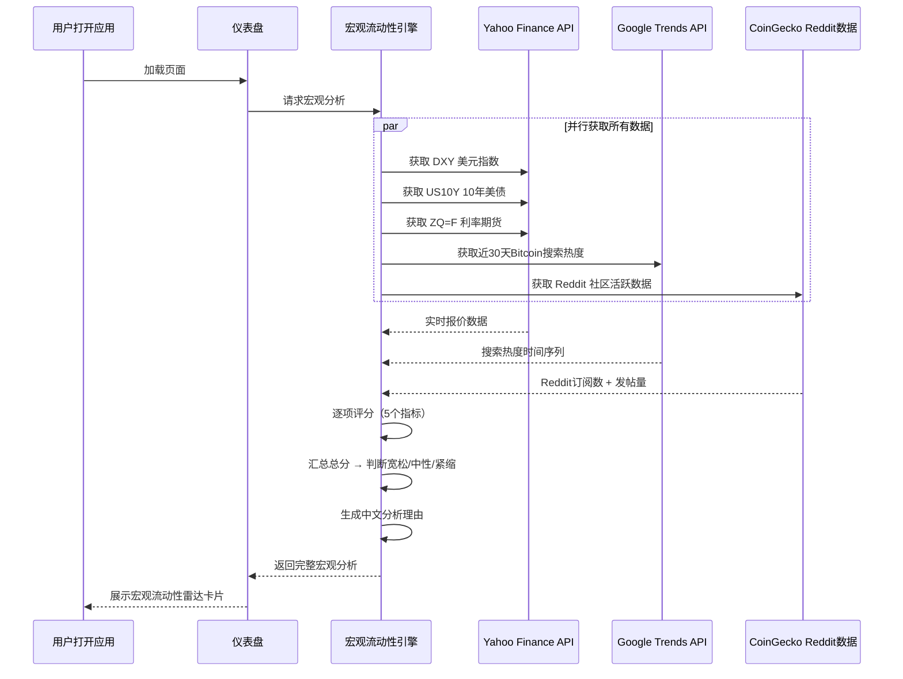
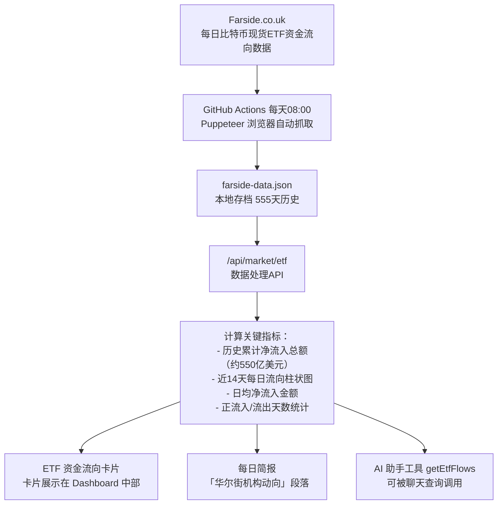

# 🌊 宏观流动性引擎：美联储如何影响比特币

> **读完本文你将理解**：为什么比特币和美联储利率政策密切相关，系统是如何实时追踪这些宏观指标的，以及「宏观流动性宽松」对你的定投意味着什么。

---

## 1. 一个反直觉的关系

很多人觉得比特币是独立于传统金融的资产，但实际上：



简单理解：
- 美联储**降息** → 美元贬值 → 资金寻找更高收益资产 → 流入比特币
- 美联储**加息** → 美元走强 → 美债收益率高 → 资金回流传统金融 → 离开比特币

---

## 2. 系统追踪的五大指标



---

## 3. 美联储利率期货（ZQ）如何解读

这是最难理解但最重要的指标：



> **通俗：** 把期货价格想象成「市场集体投票」。价格涨说明大家预计利率会降，这对BTC是好事。

---

## 4. 综合评分系统

宏观流动性引擎使用一个加权评分系统，把五个指标汇总成一个结论：



---

## 5. 各指标详细评分规则

### 美元指数（DXY）

```mermaid
table
    DXY当日涨跌幅 | 对BTC意义 | 评分
    跌幅 > 0.5% | 美元大跌，全球流动性充裕 | -2分（看涨）
    跌幅 0.2-0.5% | 美元微跌，温和利好 | -1分
    涨跌 < 0.2% | 横盘，中性 | 0分
    涨幅 0.2-0.5% | 美元偏强，轻度压制 | +1分
    涨幅 > 0.5% | 美元强势，资金避险回流 | +2分（看跌）
```

### 谷歌搜索热度（散户 FOMO 指标）



---

## 6. 完整宏观分析运行时序



---

## 7. ETF 资金流向：华尔街的实际行动

除了宏观政策预期，系统还追踪了华尔街机构的**实际买卖行动**：



> **解读指南**：
> - **净流入为正**（绿柱）→ 机构在买，有资金支撑，对价格正面
> - **净流出为负**（红柱）→ 机构在卖或赎回，短期有抛压
> - **连续多日净流出** → 需要警惕，可能是机构减仓信号
