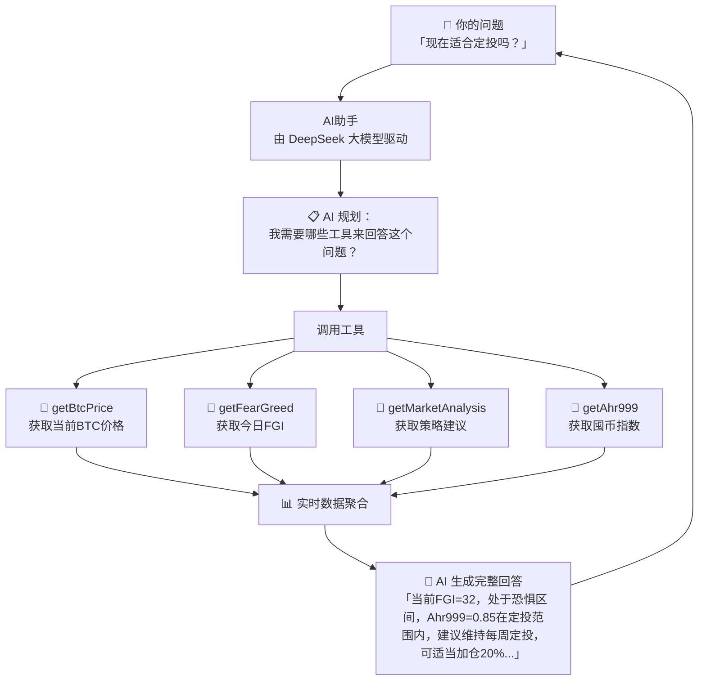
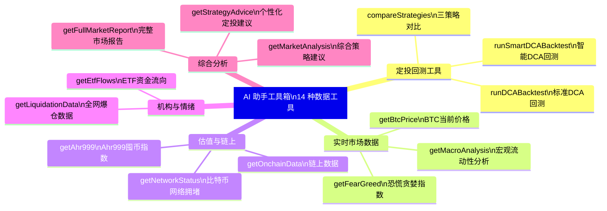
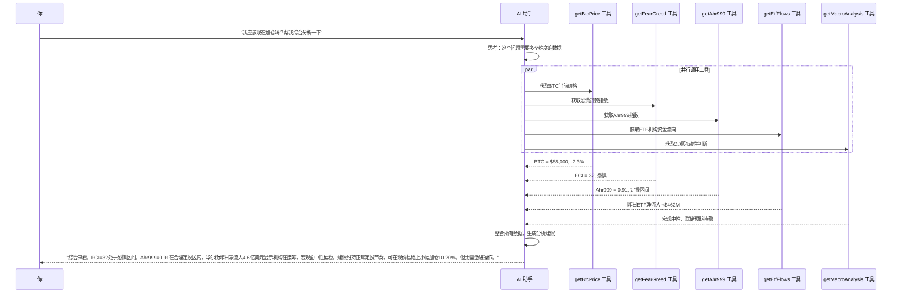
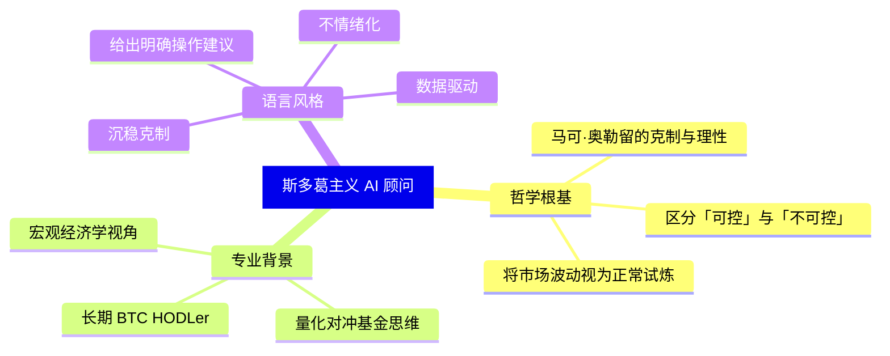
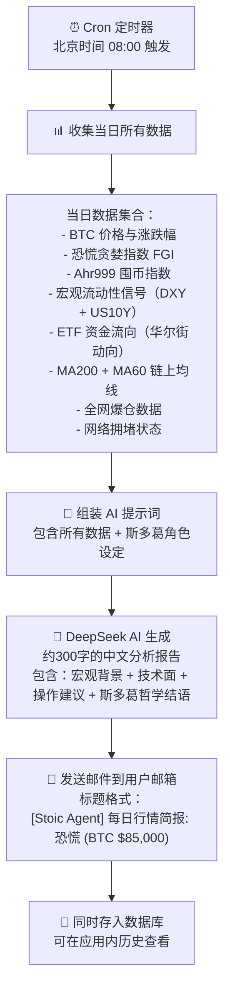
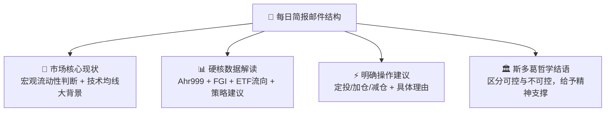
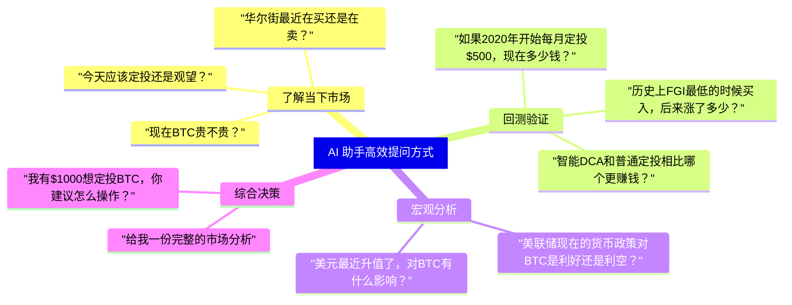

# 🤖 AI 智能助手：你的比特币专属分析师

> **读完本文你将理解**：右侧（或页面上方）的 AI 聊天窗口不是一个普通的 ChatGPT，而是一个被赋予了14种**专属数据查询工具**的比特币策略助手，它能实时调用所有系统数据来回答你的问题。

---

## 1. AI 助手是如何工作的？

普通 AI 只能回答它训练时学到的"过去知识"。我们的 AI 助手不同——它配备了工具，能**实时查询最新数据**：



---

## 2. AI 助手的完整工具清单（共14种）



---

## 3. 每个工具的功能说明

| 工具名 | 你可以问的问题示例 | 返回数据 |
|--------|-------------------|----------|
| `getBtcPrice` | "BTC现在多少钱？" | 当前价格、24h涨跌幅、市值 |
| `getFearGreed` | "今天市场情绪怎么样？" | FGI指数值(0-100) + 文字描述 |
| `getAhr999` | "Ahr999现在多少，能加仓吗？" | 指数值 + 区间标签 + 200日均线 |
| `getMacroAnalysis` | "美联储对BTC影响是什么？" | 宏观三信号 + 分析理由 |
| `getEtfFlows` | "华尔街最近在买入还是卖出？" | 最新一日ETF净流向 + 近5天趋势 |
| `runDCABacktest` | "从2020年开始定投到现在赚了多少？" | 总回报率 + 年化收益率 + 最大回撤 |
| `runSmartDCABacktest` | "智能DCA比普通定投多赚多少？" | 智能DCA回测完整结果 |
| `compareStrategies` | "定投 vs 一次性买入哪个更好？" | 三种策略并排对比 |
| `getMarketAnalysis` | "给我一个综合的市场建议" | 完整策略分析 + 置信度 |
| `getNetworkStatus` | "现在转账链上手续费高吗？" | 网络拥堵状态 + 预计手续费 |
| `getLiquidationData` | "最近爆仓多吗？" | 24h爆仓总额 + 主导爆仓方 |
| `getOnchainData` | "链上数据怎么样？" | 矿工费、活跃地址等 |
| `getStrategyAdvice` | "告诉我今天应该怎么操作" | 个性化操作建议 |
| `getFullMarketReport` | "给我一份完整的市场报告" | 所有指标的综合报告 |

---

## 4. AI 助手如何处理复杂问题

当你问一个复杂问题时，AI 会自动分解并串联多个工具：



---

## 5. AI 助手的核心人格设定（Persona）

AI 助手不是一个普通的数据播报机器人，它被设定为：



**示例对话风格差异**：

```
❌ 普通 AI 回答："比特币最近跌了很多，市场情绪不好，你需要谨慎。"

✅ 斯多葛 AI 助手回答："FGI=25，Ahr999=0.71，技术面已进入定投区间。
   价格短期波动属于不可控，你能控制的只有面对恐惧时的执行纪律。
   建议维持每周$100定投，恐惧加仓2倍。历史数据显示此类区间3年后平均回报超过300%。"
```

---

## 6. 每日简报：自动生成的深度报告

除了实时聊天，系统每天北京时间 08:00 还会自动生成并发送一封**每日行情简报**邮件：



**邮件结构示意**：



---

## 7. 你可以直接复制的提问示例


